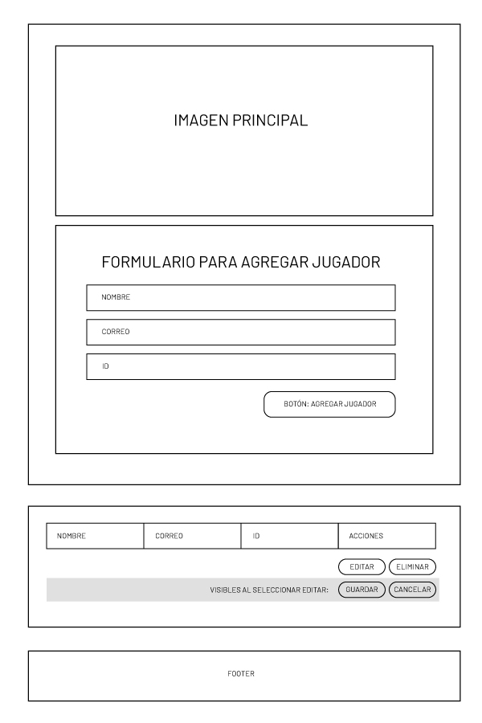

# BOOT-M1-SEM8-PROY2
Aplicación con 4 operaciones CRUD (crear, leer, actualizar, borrar)

# Mi Proyecto Spelldust
Se trata de un CRUD para agregar una lista de jugadores, con nombre, correo y ID el cual nos permirirá agregar, editar, eliminar un jugador.

# UI

# 1. Preview del sitio:
https://valeriaramirezm.github.io/VR-BOOT-M1-SEM4-PROY1/
